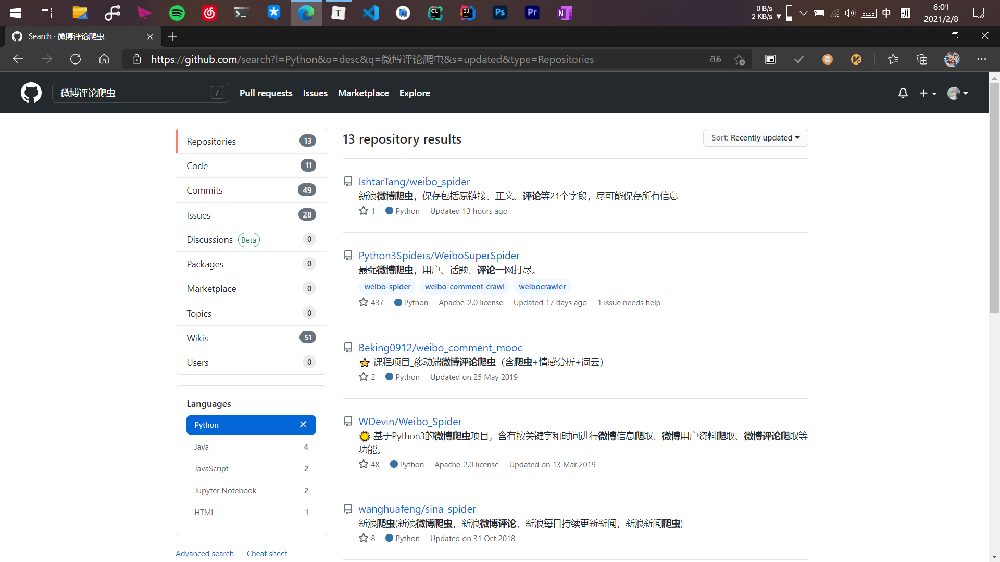
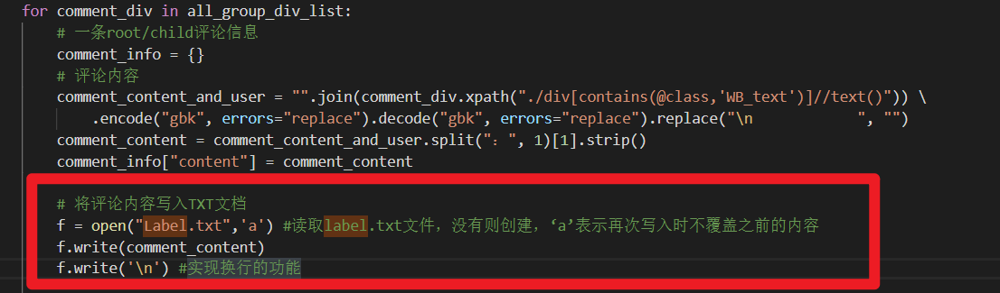
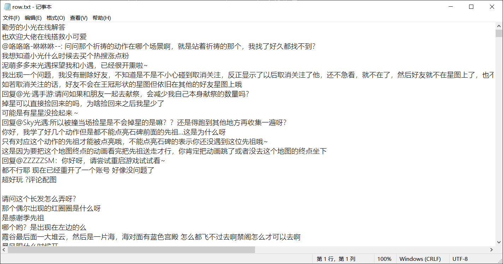
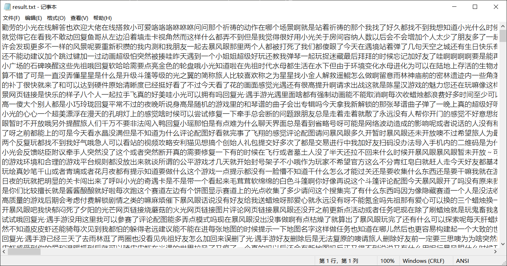
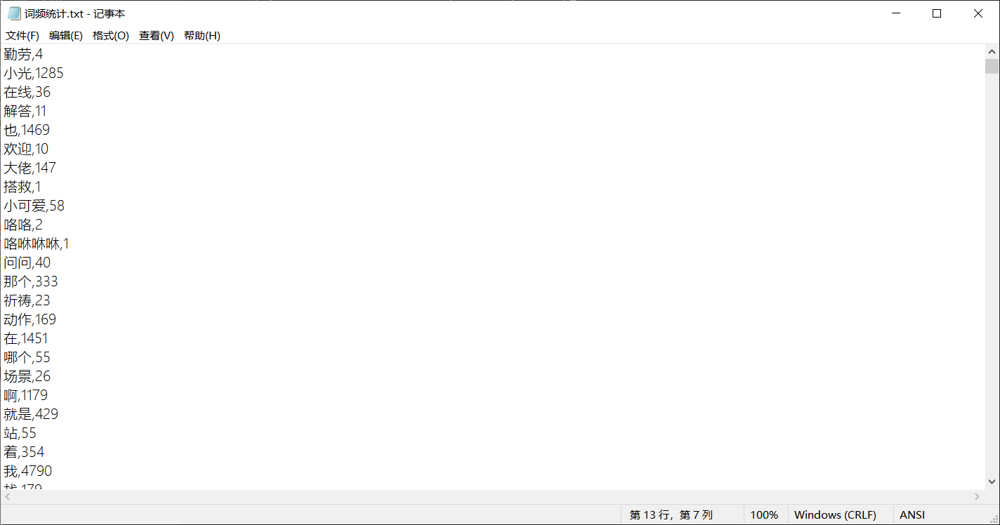

​	现在是2021年2月8号凌晨5点34分，距离昨天和人在微博上对线已经过去了大约15个小时。

## 始

​	昨天下午光遇发出一条公告，声明了对于更新后蜡烛合成机制bug的补偿。评论区依旧和往常一样骂声一片，光之子对此次bug造成的精力和物质（蜡烛）上的损失表达了强烈的不满。本来我一直在微博上面看评论区吵来吵去就图个乐，今天不知道咋了，就随手回复了其中一条


我想着这位朋友反正也就今天没拿到补偿，损失应该不到10根蜡烛，就提醒了一句补偿还有6天，没想到


好家伙，一句“少在这里放屁”一下子把我整懵了，再等我“教育”这位网友的时候我发现...我被微博限制评论了。这个倒是可以理解，因为在对线过程中我得同时招呼好几个网友，可能出发了微博“阻止机器人”的机制。但不能评论的我怎么能咽下这口气！！想着今天就要让所有人看到微博的这群光遇的玩家是有多没教养的一群人。

## 中

​	做为长期与代码打交道的光之子，第一个浮现在脑海里面的想法就是爬取小光微博下的评论，然后对语义进行提取分析（也就是常说的大爆炸，老罗牛逼！），最后通过词云的方式体现出其中最多出现的关键词。还停留在想象的阶段就能在脑子里“云”出最后的结果有多么不堪。

### 数据获取

​	有想法就开始做，首先要解决的就是数据问题，考虑到市面上存在许多第三方微博客户端，比如 Android 的 Share 和 iOS 的 vvebo 。所以微博应该有开放的API接口。但是由于自己本身没有刻意去学过爬虫的相关知识，所以要自己直接上手从头开始撸代码显得有些不现实也没必要。

​	因此按照常识，我们现在应该毫不犹豫地打开世界上最大的同性交友网站 github.com ，键入关键词“微博评论”、“爬虫”，回车键搜索，选取 Python 标签（不会吧不会吧，不会真有人觉得Python天下第一吧？），出来的结果还真不少



不过大部分都是几年前的项目，通过筛选找到了一个仅仅只在6个小时之前更新的项目，好家伙！热乎的！点进去观摩的一番这位老哥的代码，嗯不错，就是我想要的，而且老哥还直接提供了打包好的可执行程序，我甚至连python环境都省了。我他妈直接一键三连。感兴趣的酷友可以去看看 [ https://github.com/IshtarTang/weibo_spider ]


按照项目中的README文件中的指引，我成功地获取到了热乎的数据，只不过是拿我自己的微博做的测试。但是发现数据使用 json 文件存储的，而且字段很多，但我最后想要做的仅仅只是拿出评论，然后去做语义分析，因此还是逃不了看源代码（头疼）。

​	打开源码，浏览一番，定位了缓存评论内容的函数，然后自己稍作修改，实现了一下自己所需要的保存评论内容的小功能



此时代码中还有许多与我需求不相关的功能，但是考虑到最耗时间的应该是网络请求而不是文件读取，所以暂时就没有去管理那些多余的代码。修改好代码之后，又进行了一段小小的测试，功能正常，可以直接开干。

​	本次选取的是从 iOS 开服以来光遇官方所有微博下面的热评前15条，调整好参数之后开始跑代码（擦腚，开机），一共900条微博，由于每一条微博下面的评论都需要一次网络请求，所以耗时还是比较长的，一共花了我将近一个小时。得到了最终的结果



### 数据处理

​	但是结果中还包含了大量的非汉字字符，因此还需要对结果进行处理，因此我自己手撸了一段小程序，对txt文档中的汉字进行了一个过滤操作：

```python
#coding=utf-8
import re

with open('test.txt','r',encoding="utf-8") as f: # 记得换文件名
    #data = f.read().decode('gbk').encode('utf-8')
    data = f.read()
    #print(data)
    data = re.sub("[a-zA-Z0-9'!\"#$%&\'()*+,-./:;<=>?@，。?★、…【】；：《》？“”‘'！[\\]^_`{|}~\s]+", "", data)
    x = open("result.txt",'a') #读取txt文件，没有则创建，‘a’表示再次写入时不覆盖之前的内容
    x.write(data)
    #data = re.sub('[\u4E00-\u9FA5]',"", data)
    #print(data)
```

运行的结果如下：



强迫症表示对结果非常满意。

​	在将数据处理好后，接下来要做的事情就是语义分析和关键词提取了。当然，秉承着“不要重复造轮子”和“开源万岁”的精神，我依旧打开了那个网站，pia pia几下找到了合适的程序，按照惯例一键三连。[ https://github.com/fuqiuai/wordCloud ]

​	语义的处理使用的是“结巴 ( jieba ) ”包，是中文语义处理领域很有名的包，将txt文档进行处理后，程序生成了文中的关键词以及词频，共16255个不同的关键词，我只选取了前150个词。



### 生成词云

​	在得到关键词和词频之后，最后我要做的就是生成词云，回想一下脑子里残余的记忆，依稀记得我有个朋友好像做过这个东西，还发了朋友圈装13来着，但是彼时已经凌晨，不好再去打搅他。所以我还是选择了 Github 。了解到wordCloud词云生成工具之后，我下载了所需的库，但是最后一个库因为依赖问题死活装不上去。没有办法只能百度，百度后发现了在线词云工具，好家伙，世界上还有这种好事，一顿操作没想到居然还成了。（因为这个网站是营利性的网站，所以不给出链接）

​	但是...

​	看到结果之后，我突然愣住了


## 末

​	“小光”、“朋友”、“爱”、“我们”、“哈哈哈”......

​	在词云中，我并没有看到一开始期待的各种脏话，甚至都没有看到一个与其相关的字眼。

​	我看到的是玩家们对游戏内容的投入，对好友的珍惜，对每一次复刻到来的欣喜，以及对于天空王国的热爱。无论是自由广阔的云野，还是压抑惊险的墓土，也许还是像小光一开始说的那样，天空王国，是一个让温暖的灵魂相遇的地方。而那些满口脏话，充满着无礼与愤怒的那群玩家们，可能最终也只是一个冰冷的账号，也只会沦为服务器中一段毫无感情的二进制代码吧。

​	谨以此文献给那些愤怒着想要表达自己的光之子，静下来，天空王国依然温暖、美好。


