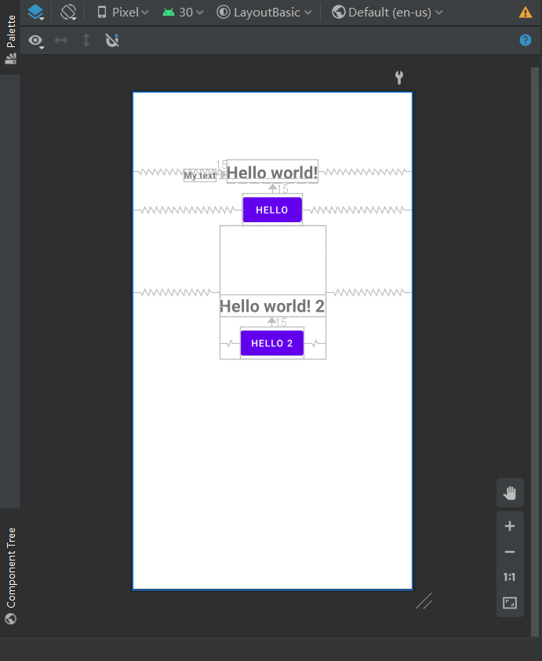
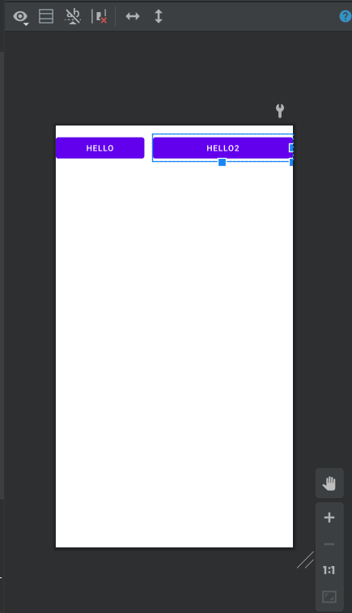
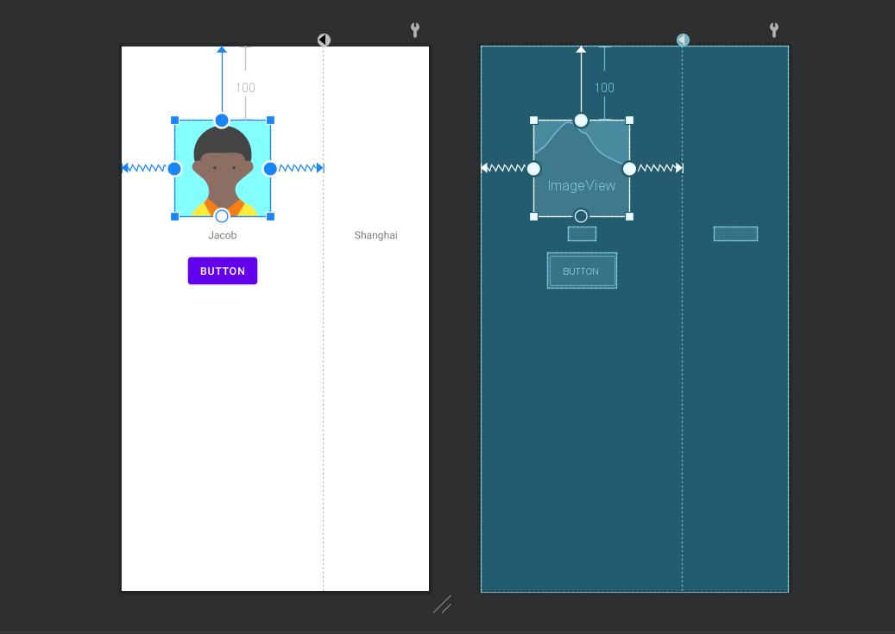
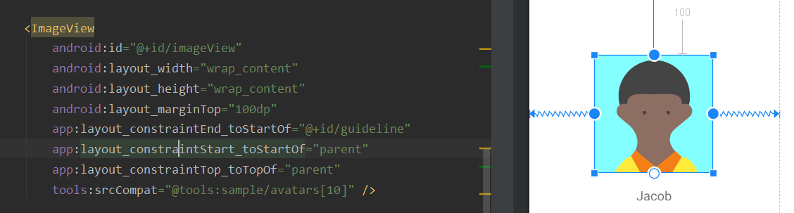
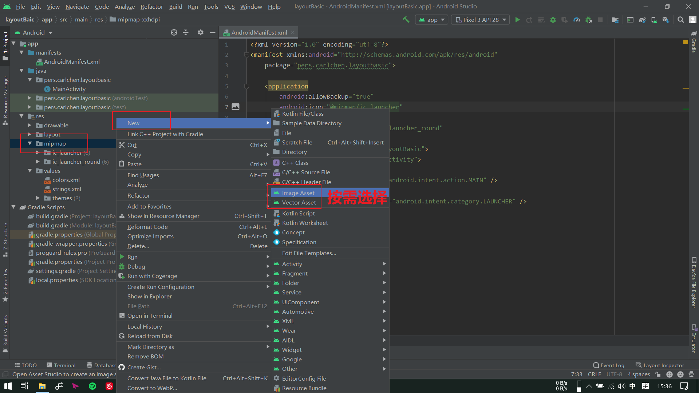
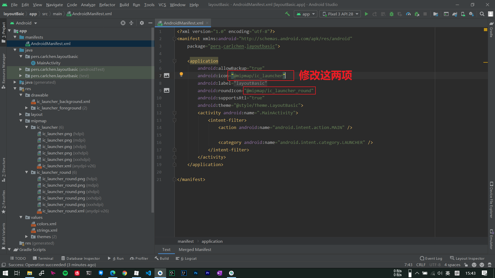
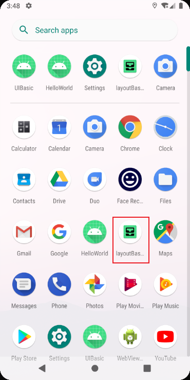
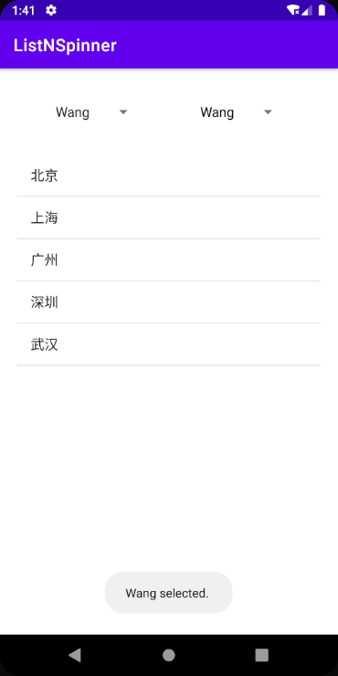

## Basic Views


* TextView: 在屏幕上显示文件的控件

* Button: 按钮控件，在用户界面中创建按钮控件
  
  * 通常按钮都需要关联一个回调方法，可以在Button的onClick属性中定义，再将方法在Java代码中实现。
  
* OnClickListener: 用于监听用户的点击事件并作出响应，这种监听可以发生在任何一个view上，例如以上两个都是可以点击的对象

* Toast: 在用户界面弹出底部气泡提示

* EditText: 输入框控件，通常用于接收用户输入

* CheckBox: 复选框

  * isChecked()

    判断复选框是否已选择

    ```java
    /**
         * add friends'name to the String 'friends'
         * @return friends'name
         */
        public String checkFriends() {
            String friends = "Friends: \n\t";
    
            //if the checkBox is checked, add it to the
            if(this.checkBoxCarl.isChecked()) {
                friends += checkBoxCarl.getText().toString() + "\n\t";
            }
            if(this.checkBoxSaiy.isChecked()) {
                friends += checkBoxSaiy.getText().toString() + "\n\t";
            }
            if(this.checkBoxShikamaru.isChecked()) {
                friends += checkBoxShikamaru.getText().toString() + "\n\t";
            }
    
            return friends;
        }
    ```

    


* RadioBGroup: 选择框组

  * RadioButton: 单选框

  * 在一个选择框组中，只能选择一个选项。

  * setOnCheckedChangeListener()

    当单选框的选择项发生变化时，此“监听器”发生作用。在监听器当中要创建一个RidioGroup对象，并重写OnCheckedChangeListener()方法，用法如下：

    ```java
    radioGroup.setOnCheckedChangeListener(new RadioGroup.OnCheckedChangeListener() {
                @Override
    
                /**
                 * pop a toast whichever the element checked.
                 */
                public void onCheckedChanged(RadioGroup group, int checkedId) {
                    switch (checkedId) {
                        case R.id.rbMale:
                            Toast.makeText(MainActivity.this, "Male checked.", Toast.LENGTH_SHORT).show();
                            break;
                        case R.id.rbFemale:
                            Toast.makeText(MainActivity.this, "Female checked.", Toast.LENGTH_SHORT).show();
                            break;
                        default:
                            break;
                    }
                }
            });
    ```
    
  * getCheckedRadioButtonId()
  
    在实际作用代码中，对于单选框的所选项进行判断，获取被选择项的id，再执行相应的操作（代码段）。
  
    ```java
     //获取RadioGroup单选项中的选项值，设置所选性别
                        int radioBtn = radioGroup.getCheckedRadioButtonId();
                        String gender = "Male";
                        switch (radioBtn) {
                            case R.id.rbMale:
                                gender = "Male";
                                break;
                            case R.id.rbFemale:
                                gender = "Female";
                                break;
                            default:
                                break;
                        }
    ```
  
* ProgressBar: 进度提示，可选圆形或横向进度条\

## Layouts Basic

### RelativeLayout

	[Android官方文档](https://developer.android.com/guide/topics/ui/layout/relative?hl=en)：A Layout where the positions of the children can be described in relation to each other or to the parent.
	
	在RelativeLayout下，每一个View之间存在相对的位置关系，并通过其中的XML参数进行位置的调整。具体的参数值可以在[此处](https://developer.android.com/reference/android/widget/RelativeLayout.LayoutParams)查看。

​	**示例：**

```xml
<?xml version="1.0" encoding="utf-8"?>
<RelativeLayout xmlns:android="http://schemas.android.com/apk/res/android"
    xmlns:app="http://schemas.android.com/apk/res-auto"
    xmlns:tools="http://schemas.android.com/tools"
    android:layout_width="match_parent"
    android:layout_height="match_parent"
    tools:context=".MainActivity">

    <TextView
        android:id="@+id/txtHello"
        android:layout_width="wrap_content"
        android:layout_height="wrap_content"
        android:text="Hello world!"
        android:textStyle="bold"
        android:textSize="25sp"
        android:layout_centerHorizontal="true"
        android:layout_marginTop="100dp"/>

<!--android:layout_alignBaseline="@+id/txtHello": 使其位于txtHello的同一水平线位置
    android:layout_toLeftOf="@+id/txtHello": 使其位于txtHello的左边-->
    <TextView
        android:id="@+id/txtMytext"
        android:layout_width="wrap_content"
        android:layout_height="wrap_content"
        android:text="My text"
        android:textStyle="bold"
        android:layout_toLeftOf="@+id/txtHello"
        android:layout_alignBaseline="@+id/txtHello"
        android:layout_marginRight="15dp"/>

<!--这里的Button通过layout_below属性，使其位于txtHello的下方-->
    <Button
        android:id="@+id/btnHello"
        android:layout_width="wrap_content"
        android:layout_height="wrap_content"
        android:text="hello"
        android:layout_below="@+id/txtHello"
        android:layout_centerHorizontal="true"
        android:layout_marginTop="15dp" />

<!--Layout中可以包含其他的Layout-->
    <RelativeLayout
        android:id="@+id/relativeLayoutWithin"
        android:layout_width="wrap_content"
        android:layout_height="wrap_content"
        android:layout_below="@id/btnHello"
        android:layout_centerHorizontal="true">

        <TextView
            android:id="@+id/txtHello2"
            android:layout_width="wrap_content"
            android:layout_height="wrap_content"
            android:text="Hello world! 2"
            android:textStyle="bold"
            android:textSize="25sp"
            android:layout_centerHorizontal="true"
            android:layout_marginTop="100dp"/>

        <!--这里的Button通过layout_below属性，使其位于txtHello的下方-->
        <Button
            android:id="@+id/btnHello2"
            android:layout_width="wrap_content"
            android:layout_height="wrap_content"
            android:text="hello 2"
            android:layout_below="@+id/txtHello2"
            android:layout_centerHorizontal="true"
            android:layout_marginTop="15dp" />

    </RelativeLayout>


</RelativeLayout>
```




### LinearLayout

	[Android开发文档](https://developer.android.com/reference/android/widget/LinearLayout)：A layout that arranges other views either horizontally in a single column or vertically in a single row.
	
	在LinearLayout中，开发者所定义的各个View之间的位置关系会默认地设置为线性关系，也就是说各个View之间不会有重叠的可能，它们会在视图中依次排开。
	
	**示例：**

```xml
<?xml version="1.0" encoding="utf-8"?>
<LinearLayout xmlns:android="http://schemas.android.com/apk/res/android"
    xmlns:app="http://schemas.android.com/apk/res-auto"
    xmlns:tools="http://schemas.android.com/tools"
    android:layout_width="match_parent"
    android:layout_height="match_parent"
    tools:context=".MainActivity">

    <Button
        android:id="@+id/btnHello"
        android:layout_width="wrap_content"
        android:layout_height="wrap_content"
        android:text="hello"
        android:layout_centerHorizontal="true"
        android:layout_marginTop="15dp"
        android:layout_weight="3"/>

    <Button
        android:id="@+id/btnHello2"
        android:layout_width="wrap_content"
        android:layout_height="wrap_content"
        android:text="hello2"
        android:layout_centerHorizontal="true"
        android:layout_marginTop="15dp"
        android:layout_weight="7"
        android:layout_marginLeft="15dp"/>
    
</LinearLayout>
```




### ConstriantLayout

	[Android开发文档](https://developer.android.com/training/constraint-layout?hl=en)：[`ConstraintLayout`](https://developer.android.com/reference/androidx/constraintlayout/widget/ConstraintLayout) allows you to create large and complex layouts with a flat view hierarchy (no nested view groups). It's similar to [`RelativeLayout`](https://developer.android.com/reference/android/widget/RelativeLayout) in that all views are laid out according to relationships between sibling views and the parent layout, but it's more flexible than `RelativeLayout` and easier to use with Android Studio's Layout Editor.
	
	ConstraintLayout布局中，各个View之间通过参数调整彼此以及父布局的约束位置，达到对于View位置的调整。这种布局比RelativeLayout更加灵活，因为在位置限制上有更加多样化的选择。
	
	示例（ConstraintLayout可以使用图形化界面进行搭建，方便许多，其中的操作超级无敌容易上手，推荐使用）：



## Image

### 普通图片视图ImageView

```xml
<ImageView
        android:id="@+id/imageView"
        android:layout_width="wrap_content"
        android:layout_height="wrap_content"
        android:layout_marginTop="100dp"
        app:layout_constraintEnd_toStartOf="@+id/guideline"
        app:layout_constraintStart_toStartOf="parent"
        app:layout_constraintTop_toTopOf="parent"
        tools:srcCompat="@tools:sample/avatars[10]" />
```



### 应用icon

​	将图片资源文件保存在`resources`文件夹的对应目录后，在`AndroidManifest.xml`文件中将应用icon项的参数调整为自己添加的图片资源文件。

1. 添加图片资源文件

   

2. 修改icon参数

   

3. 修改效果

   

## ListView and  Spinner

### ListView

* 这个View已经过时，不推荐使用，所以只做简单的用法举例

**xml文件中定义：**

```xml
<?xml version="1.0" encoding="utf-8"?>
<androidx.constraintlayout.widget.ConstraintLayout xmlns:android="http://schemas.android.com/apk/res/android"
    xmlns:app="http://schemas.android.com/apk/res-auto"
    xmlns:tools="http://schemas.android.com/tools"
    android:layout_width="match_parent"
    android:layout_height="match_parent"
    tools:context=".MainActivity">

    <ListView
        android:id="@+id/citiesListView"
        android:layout_width="match_parent"
        android:layout_height="match_parent"
        android:layout_marginLeft="20dp"
        android:layout_marginTop="100dp"
        android:layout_marginRight="20dp" />

    <Spinner
        android:id="@+id/stuSpinner"
        android:layout_width="wrap_content"
        android:layout_height="wrap_content"
        app:layout_constraintBottom_toTopOf="@+id/citiesListView"
        app:layout_constraintEnd_toEndOf="parent"
        app:layout_constraintHorizontal_bias="0.5"
        app:layout_constraintStart_toEndOf="@+id/stuSpinner2"
        app:layout_constraintTop_toTopOf="parent" />

    <Spinner
        android:id="@+id/stuSpinner2"
        android:layout_width="wrap_content"
        android:layout_height="wrap_content"
        app:layout_constraintBottom_toTopOf="@+id/citiesListView"
        app:layout_constraintEnd_toStartOf="@+id/stuSpinner"
        app:layout_constraintHorizontal_bias="0.5"
        app:layout_constraintStart_toStartOf="parent"
        app:layout_constraintTop_toTopOf="parent"
        android:entries="@array/stus"/>

</androidx.constraintlayout.widget.ConstraintLayout>
```

**Java代码中实现业务功能：**

```java
package pers.carlchen.listnspinner;

import androidx.appcompat.app.AppCompatActivity;

import android.os.Bundle;
import android.view.View;
import android.widget.AdapterView;
import android.widget.ArrayAdapter;
import android.widget.ListView;
import android.widget.Spinner;
import android.widget.Toast;

import java.util.ArrayList;

public class MainActivity extends AppCompatActivity {

    private ListView citiesList;
    private Spinner stuSpinner;
    private Spinner stuSpinner2;

    @Override
    protected void onCreate(Bundle savedInstanceState) {
        super.onCreate(savedInstanceState);
        setContentView(R.layout.activity_main);

        //绑定xml文件中定义的View
        citiesList = findViewById(R.id.citiesListView);
        stuSpinner = findViewById(R.id.stuSpinner);
        stuSpinner2 = findViewById(R.id.stuSpinner2);

        //创建列表存储信息
        ArrayList<String> cities = new ArrayList<>();
        ArrayList<String> students = new ArrayList<>();

        //cities
        cities.add("北京");
        cities.add("上海");
        cities.add("广州");
        cities.add("深圳");
        cities.add("武汉");

        //stus
        students.add("Wang");
        students.add("Chen");
        students.add("Huang");
        students.add("Shen");
        students.add("Che");

        //创建Adapter用于将ArrayList中的数据传递给View
        ArrayAdapter<String> citiesAdapter = new ArrayAdapter<>(
                this,
                android.R.layout.simple_list_item_1,
                cities
        );

        ArrayAdapter<String> stuAdapter = new ArrayAdapter<>(
                this,
                android.R.layout.simple_spinner_dropdown_item,
                students
        );

        //传递Adapter中的数据给View
        citiesList.setAdapter(citiesAdapter);
        stuSpinner.setAdapter(stuAdapter);

        //为ListView中的数据项创建点击事件的监听方法
        citiesList.setOnItemClickListener(new AdapterView.OnItemClickListener() {
            @Override
            public void onItemClick(AdapterView<?> parent, View view, int position, long id) {
                Toast.makeText(MainActivity.this, cities.get(position) + " selected", Toast.LENGTH_SHORT).show();
            }
        });

        stuSpinner.setOnItemSelectedListener(new AdapterView.OnItemSelectedListener() {
            @Override
            public void onItemSelected(AdapterView<?> parent, View view, int position, long id) {
                Toast.makeText(MainActivity.this, students.get(position) + " selected. ", Toast.LENGTH_SHORT).show();
            }

            @Override
            public void onNothingSelected(AdapterView<?> parent) {

            }
        });

        stuSpinner2.setOnItemSelectedListener(new AdapterView.OnItemSelectedListener() {
            @Override
            public void onItemSelected(AdapterView<?> parent, View view, int position, long id) {
                Toast.makeText(MainActivity.this, stuSpinner2.getSelectedItem().toString() + " selected. ", Toast.LENGTH_SHORT).show();
            }

            @Override
            public void onNothingSelected(AdapterView<?> parent) {

            }
        });
    }
}
```


### Spinner

* 说人话就是下拉式选择框，默认界面奇丑无比，希望MD中有能够替代的包...
* 包括通过Adapter给出数据以及在String.xml中写好后在entries属性中内建两种数据给出方式，均已给出实现方法

**示例已于ListView中共同给出，参见上一节**

效果展示[包括ListVeiw和Spinner]：



