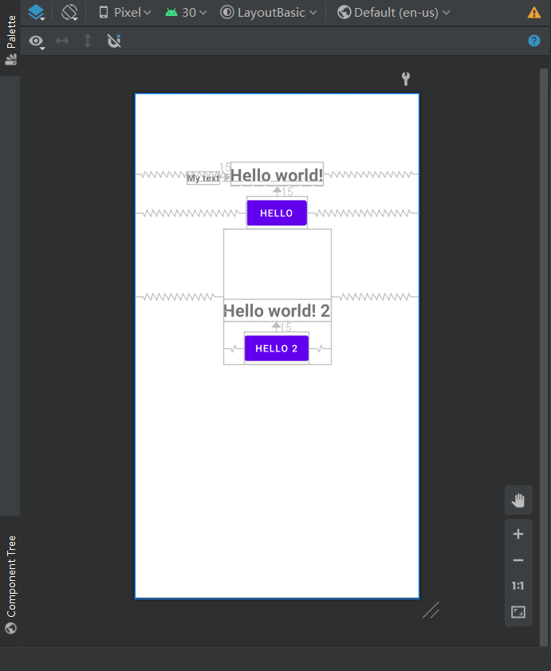
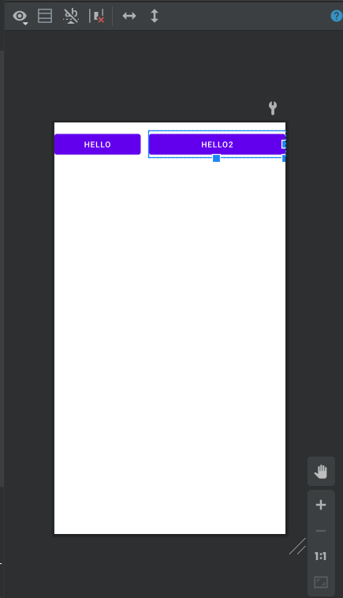
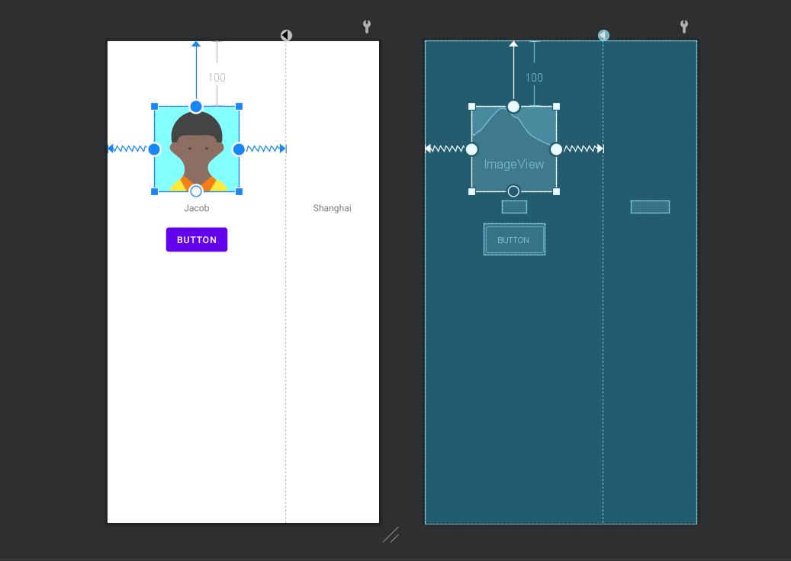

## Layouts Basic

### RelativeLayout

​	[Android官方文档](https://developer.android.com/guide/topics/ui/layout/relative?hl=en)：A Layout where the positions of the children can be described in relation to each other or to the parent.

​	在RelativeLayout下，每一个View之间存在相对的位置关系，并通过其中的XML参数进行位置的调整。具体的参数值可以在[此处](https://developer.android.com/reference/android/widget/RelativeLayout.LayoutParams)查看。

​	**示例：**

```xml
<?xml version="1.0" encoding="utf-8"?>
<RelativeLayout xmlns:android="http://schemas.android.com/apk/res/android"
    xmlns:app="http://schemas.android.com/apk/res-auto"
    xmlns:tools="http://schemas.android.com/tools"
    android:layout_width="match_parent"
    android:layout_height="match_parent"
    tools:context=".MainActivity">

    <TextView
        android:id="@+id/txtHello"
        android:layout_width="wrap_content"
        android:layout_height="wrap_content"
        android:text="Hello world!"
        android:textStyle="bold"
        android:textSize="25sp"
        android:layout_centerHorizontal="true"
        android:layout_marginTop="100dp"/>

<!--android:layout_alignBaseline="@+id/txtHello": 使其位于txtHello的同一水平线位置
    android:layout_toLeftOf="@+id/txtHello": 使其位于txtHello的左边-->
    <TextView
        android:id="@+id/txtMytext"
        android:layout_width="wrap_content"
        android:layout_height="wrap_content"
        android:text="My text"
        android:textStyle="bold"
        android:layout_toLeftOf="@+id/txtHello"
        android:layout_alignBaseline="@+id/txtHello"
        android:layout_marginRight="15dp"/>

<!--这里的Button通过layout_below属性，使其位于txtHello的下方-->
    <Button
        android:id="@+id/btnHello"
        android:layout_width="wrap_content"
        android:layout_height="wrap_content"
        android:text="hello"
        android:layout_below="@+id/txtHello"
        android:layout_centerHorizontal="true"
        android:layout_marginTop="15dp" />

<!--Layout中可以包含其他的Layout-->
    <RelativeLayout
        android:id="@+id/relativeLayoutWithin"
        android:layout_width="wrap_content"
        android:layout_height="wrap_content"
        android:layout_below="@id/btnHello"
        android:layout_centerHorizontal="true">

        <TextView
            android:id="@+id/txtHello2"
            android:layout_width="wrap_content"
            android:layout_height="wrap_content"
            android:text="Hello world! 2"
            android:textStyle="bold"
            android:textSize="25sp"
            android:layout_centerHorizontal="true"
            android:layout_marginTop="100dp"/>

        <!--这里的Button通过layout_below属性，使其位于txtHello的下方-->
        <Button
            android:id="@+id/btnHello2"
            android:layout_width="wrap_content"
            android:layout_height="wrap_content"
            android:text="hello 2"
            android:layout_below="@+id/txtHello2"
            android:layout_centerHorizontal="true"
            android:layout_marginTop="15dp" />

    </RelativeLayout>


</RelativeLayout>
```




### LinearLayout

​	[Android开发文档](https://developer.android.com/reference/android/widget/LinearLayout)：A layout that arranges other views either horizontally in a single column or vertically in a single row.

​	在LinearLayout中，开发者所定义的各个View之间的位置关系会默认地设置为线性关系，也就是说各个View之间不会有重叠的可能，它们会在视图中依次排开。

​	**示例：**

```xml
<?xml version="1.0" encoding="utf-8"?>
<LinearLayout xmlns:android="http://schemas.android.com/apk/res/android"
    xmlns:app="http://schemas.android.com/apk/res-auto"
    xmlns:tools="http://schemas.android.com/tools"
    android:layout_width="match_parent"
    android:layout_height="match_parent"
    tools:context=".MainActivity">

    <Button
        android:id="@+id/btnHello"
        android:layout_width="wrap_content"
        android:layout_height="wrap_content"
        android:text="hello"
        android:layout_centerHorizontal="true"
        android:layout_marginTop="15dp"
        android:layout_weight="3"/>

    <Button
        android:id="@+id/btnHello2"
        android:layout_width="wrap_content"
        android:layout_height="wrap_content"
        android:text="hello2"
        android:layout_centerHorizontal="true"
        android:layout_marginTop="15dp"
        android:layout_weight="7"
        android:layout_marginLeft="15dp"/>
    
</LinearLayout>
```




### ConstriantLayout

​	[Android开发文档](https://developer.android.com/training/constraint-layout?hl=en)：[`ConstraintLayout`](https://developer.android.com/reference/androidx/constraintlayout/widget/ConstraintLayout) allows you to create large and complex layouts with a flat view hierarchy (no nested view groups). It's similar to [`RelativeLayout`](https://developer.android.com/reference/android/widget/RelativeLayout) in that all views are laid out according to relationships between sibling views and the parent layout, but it's more flexible than `RelativeLayout` and easier to use with Android Studio's Layout Editor.

​	ConstraintLayout布局中，各个View之间通过参数调整彼此以及父布局的约束位置，达到对于View位置的调整。这种布局比RelativeLayout更加灵活，因为在位置限制上有更加多样化的选择。

​	示例（ConstraintLayout可以使用图形化界面进行搭建，方便许多，其中的操作超级无敌容易上手，推荐使用）：



