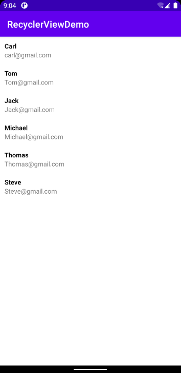

用通讯录演示RecyclerView

## 创建RecyclerView所需的布局文件

1. 在布局文件中创建RecyclerView并在Java文件中定义声明

```xml
<androidx.recyclerview.widget.RecyclerView
        android:id="@+id/contactsRecView"
        android:layout_width="match_parent"
        android:layout_height="match_parent" />
```

```java
private RecyclerView contactsRecView;

    @Override
    protected void onCreate(Bundle savedInstanceState) {
        super.onCreate(savedInstanceState);
        setContentView(R.layout.activity_main);

        contactsRecView = findViewById(R.id.contactsRecView);

    }
```

2. 创建放置于RecyclerView中的布局

file: `contact_item_list.xml`

```xml
<?xml version="1.0" encoding="utf-8"?>
<androidx.constraintlayout.widget.ConstraintLayout
    xmlns:android="http://schemas.android.com/apk/res/android"
    xmlns:app="http://schemas.android.com/apk/res-auto"
    android:layout_width="match_parent"
    android:layout_height="wrap_content"
    android:padding="10dp"
    android:id="@+id/contactParent"
    >

    <TextView
        android:id="@+id/contactName"
        android:layout_width="wrap_content"
        android:layout_height="wrap_content"
        android:text="Contact Name"
        app:layout_constraintBottom_toBottomOf="parent"
        app:layout_constraintStart_toStartOf="parent"
        app:layout_constraintTop_toTopOf="parent" />

</androidx.constraintlayout.widget.ConstraintLayout>
```

## 创建通讯录模型

```java
package pers.carl.recyclerviewdemo.entities;

public class Contact {

    private String name;
    private String Email;
    private String imgURL;

    public Contact(String name, String email, String imgURL) {
        this.name = name;
        Email = email;
        this.imgURL = imgURL;
    }

    public Contact() {
    }

    public String getName() {
        return name;
    }

    public void setName(String name) {
        this.name = name;
    }

    public String getEmail() {
        return Email;
    }

    public void setEmail(String email) {
        Email = email;
    }

    public String getImgURL() {
        return imgURL;
    }

    public void setImgURL(String imgURL) {
        this.imgURL = imgURL;
    }

    @Override
    public String toString() {
        return "Contact{" +
                "name='" + name + '\'' +
                ", Email='" + Email + '\'' +
                ", imgURL='" + imgURL + '\'' +
                '}';
    }
}

```


## 创建RecyclerView的Adapter

1. 新建file: `ContactsRecViewAdapter.java`

2. 在类中创建**内部类**`ViewHolder extends RecyclerView.ViewHolder`，用于访问xml文件中的View。

```java
public class ViewHolder extends RecyclerView.ViewHolder {

        private TextView contactName;
        public ViewHolder(@NonNull View itemView) {
            super(itemView);
            contactName = itemView.findViewById(R.id.contactName);
        }
    }
```

3. 主类继承`RecyclerView.Adapter<[主类].ViewHolder>`，并重写`Adapter`中的三个方法。

```java
@NonNull
    @Override
    public ViewHolder onCreateViewHolder(@NonNull ViewGroup parent, int viewType) {
        return null;
    }

    @Override
    public void onBindViewHolder(@NonNull ViewHolder holder, int position) {

    }

    @Override
    public int getItemCount() {
        return contacts.size();
    }
```

4. 创建用于接收通讯录列表的方法

```java
public void setContacts(ArrayList<Contact> contacts) {
        this.contacts = contacts;
        //notify the ViewHolder if the data changed in the contacts
        notifyDataSetChanged();
    }
```

5. 在`public ViewHolder onCreateViewHolder(@NonNull ViewGroup parent, int viewType)`中创建一个View，用于显示通讯录的项目。

```java
public ViewHolder onCreateViewHolder(@NonNull ViewGroup parent, int viewType) {
        View view = LayoutInflater.from(parent.getContext()).inflate(R.layout.contact_item_list, parent, false);
        ViewHolder holder = new ViewHolder(view);
        return holder;
    }
```

6. 在`onBindViewHolder()`方法中设置要显示的内容

```java
public void onBindViewHolder(@NonNull ViewHolder holder, int position) {
        holder.contactName.setText(contacts.get(position).getName());

    }
```

## 使用RecyclerView的Adapter对内容进行显示

1. 定义数据，可以使用数据库，本例子直接使用内建的数据，图方便

```java
ArrayList<Contact> contacts = new ArrayList<>();
        contacts.add(new Contact("Carl", "carl@gmail.com", "https://img2.woyaogexing.com/2018/08/31/931ad72ea90e0abf!480x480.jpg"));
        contacts.add(new Contact("Tom", "Tom@gmail.com", "https://th.bing.com/th/id/R5679d3cab9c0e3337f9f525bed2c9bca?rik=Igyui%2bRNTiKM1w&riu=http%3a%2f%2fimg.crcz.com%2fallimg%2f201910%2f03%2f1570070372115992.jpg&ehk=2YJxO3Osp4%2bLbjchnxU18YHKTEueK43WFr3ekeiHk2c%3d&risl=&pid=ImgRaw"));
        contacts.add(new Contact("Jack", "Jack@gmail.com", "https://www.keaidian.com/uploads/allimg/190213/13174508_2.jpeg"));
        contacts.add(new Contact("Michael", "Michael@gmail.com", "https://www.keaidian.com/uploads/allimg/190131/co1Z1310S128-0-31.jpg"));
        contacts.add(new Contact("Thomas", "Thomas@gmail.com", "https://www.keaidian.com/uploads/allimg/190108/co1Z10Q32551-0-10.jpg"));
        contacts.add(new Contact("Steve", "Steve@gmail.com", "https://www.keaidian.com/uploads/allimg/190704/04112049_5.jpeg"));
```

2. 声明Adapter并将数据传入Adapter

```java
ContactsRecViewAdapter adapter = new ContactsRecViewAdapter();
adapter.setContacts(contacts);
```

3. 将Adapter添加到需要的RecyclerView中，并设置其布局

```java
contactsRecView.setAdapter(adapter);
contactsRecView.setLayoutManager(new LinearLayoutManager(this));
```


## 对每一个contacts_item_list设置点击事件

1. 在RecyclerViewAdapter的ViewHolder中获取到contacts_item_list布局

```java
public class ViewHolder extends RecyclerView.ViewHolder {

        private TextView contactName;
        private TextView contactEmail;
        private ConstraintLayout contactsParent;
        public ViewHolder(@NonNull View itemView) {
            super(itemView);
            contactName = itemView.findViewById(R.id.contactName);
            contactEmail = itemView.findViewById(R.id.contactEmail);
            contactsParent = itemView.findViewById(R.id.contactParent); //此行
        }
    }
```

2. 在`onBindViewHolder()`中为`contactsParent`设置点击事件

```java
holder.contactsParent.setOnClickListener(new View.OnClickListener() {
            @Override
            public void onClick(View v) {
                Toast.makeText(context, contacts.get(position).getName() + "clicked", Toast.LENGTH_SHORT).show();
            }
        });

/**
* 其中的context为定义Toast的需要，临时在Adapter中添加的成员变量，其最原始的传入值为MainActivity中的this
* 随Adapter的创建传入的构造参数
*/
```

## 最终效果

