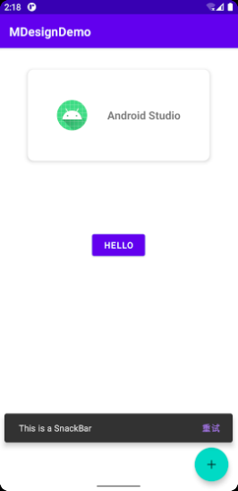

## Snackbar

​	Snackbar类似于传统的Toast提示，但是比Toast提示更美观便捷，功能更强，而且更容易控制。

**创建Snackbar**

​	为了测试，首先创建一个按钮，用于显示SnackBar

```xml
<Button
        android:id="@+id/btnShowSnackBar"
        android:layout_width="wrap_content"
        android:layout_height="wrap_content"
        android:layout_centerInParent="true"
        android:text="Hello"
        app:layout_constraintBottom_toBottomOf="parent"
        app:layout_constraintEnd_toEndOf="parent"
        app:layout_constraintStart_toStartOf="parent"
        app:layout_constraintTop_toTopOf="parent" />
```

​	在 Java 代码中，创建按钮的点击事件，点击时显示Snackbar

```java
btnShowSnackBar.setOnClickListener(new View.OnClickListener() { //set a on click listener
            @Override
            public void onClick(View v) {
                showSnackBar();
            } //to show the snackbar
        });

---------------------------------------

private void showSnackBar() {
        Snackbar.make(parent, "This is a SnackBar", Snackbar.LENGTH_SHORT) //定义Snackbar中现实的内容，以及其显示的时间长短
                .setAction("重试", new View.OnClickListener() {  //为其添加一个按钮，按钮也自带一个点击事件
                    @Override
                    public void onClick(View v) {
                        Toast.makeText(MainActivity.this, "SnackBar clicked", Toast.LENGTH_SHORT).show(); //点击后显示一段Toast提示
                    }
                })
                .setAnchorView(R.id.floatingAB) //put the snack bar on the top of the floating action bar.
                .show();
    }

```

​	最终效果--底部的弹出提示



## CardView

​	卡片风格的布局容器，其中可以添加多种布局，且能随意调控其样式。配合RecycleView可以做出许多强大的页面。

**创建卡片**

​	在xml文件中创建Material风格的卡片

```xml
<com.google.android.material.card.MaterialCardView
        android:id="@+id/cardView"
        android:layout_width="300dp"
        android:layout_height="150dp"
        app:layout_constraintBottom_toTopOf="@+id/btnShowSnackBar"
        app:layout_constraintEnd_toEndOf="parent"
        app:layout_constraintStart_toStartOf="parent"
        app:layout_constraintTop_toTopOf="parent"
        app:cardCornerRadius="10dp"
        app:cardBackgroundColor="#fff"
        app:cardElevation="5dp">
    
</com.google.android.material.card.MaterialCardView>
```

​	并在其中定义一个ConstraintLayout布局

```xml
<com.google.android.material.card.MaterialCardView
        android:id="@+id/cardView"
        android:layout_width="300dp"
        android:layout_height="150dp"
        app:layout_constraintBottom_toTopOf="@+id/btnShowSnackBar"
        app:layout_constraintEnd_toEndOf="parent"
        app:layout_constraintStart_toStartOf="parent"
        app:layout_constraintTop_toTopOf="parent"
        app:cardCornerRadius="10dp"
        app:cardBackgroundColor="#fff"
        app:cardElevation="5dp">

        <androidx.constraintlayout.widget.ConstraintLayout
            android:id="@+id/constraintInCard"
            android:layout_width="match_parent"
            android:layout_height="match_parent"
            android:layout_margin="15dp">

            <ImageView
                android:id="@+id/imageView"
                android:layout_width="50dp"
                android:layout_height="50dp"
                android:src="@mipmap/ic_launcher_round"
                app:layout_constraintBottom_toBottomOf="@+id/textView"
                app:layout_constraintEnd_toStartOf="@+id/textView"
                app:layout_constraintHorizontal_bias="0.5"
                app:layout_constraintStart_toStartOf="parent"
                app:layout_constraintTop_toTopOf="@+id/textView" />

            <TextView
                android:id="@+id/textView"
                android:layout_width="wrap_content"
                android:layout_height="wrap_content"
                android:text="Android Studio"
                android:textSize="18sp"
                android:textStyle="bold"
                app:layout_constraintBottom_toBottomOf="parent"
                app:layout_constraintEnd_toEndOf="parent"
                app:layout_constraintHorizontal_bias="0.5"
                app:layout_constraintStart_toEndOf="@+id/imageView"
                app:layout_constraintTop_toTopOf="parent" />


        </androidx.constraintlayout.widget.ConstraintLayout>

    </com.google.android.material.card.MaterialCardView>
```

​	最终效果--页面上部的卡片

