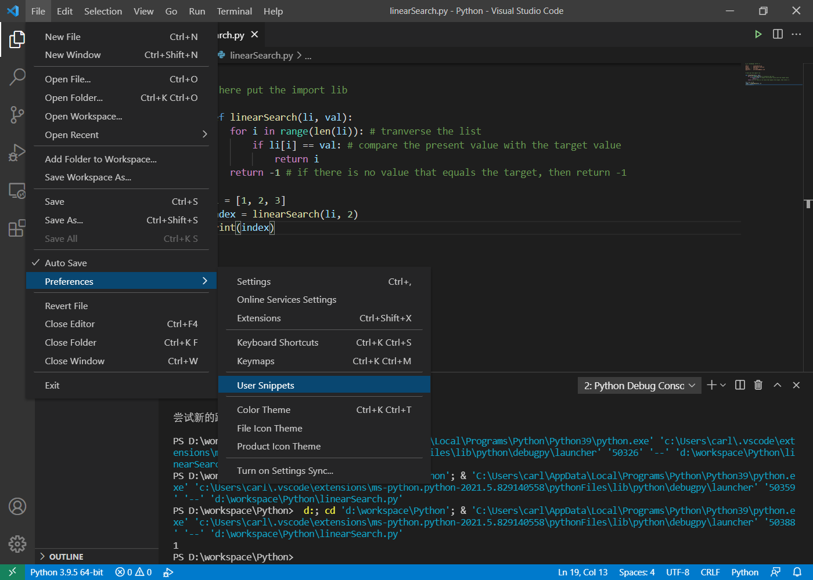
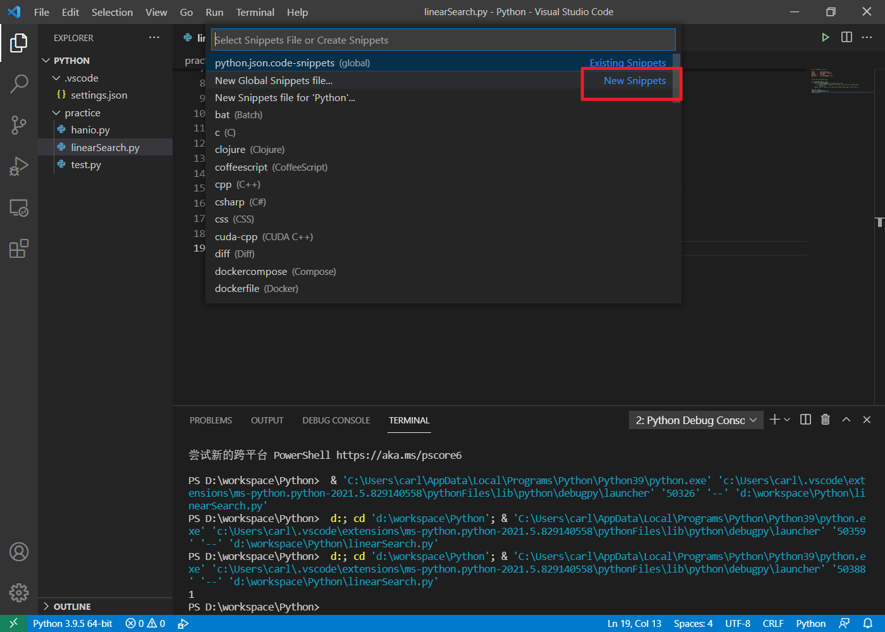
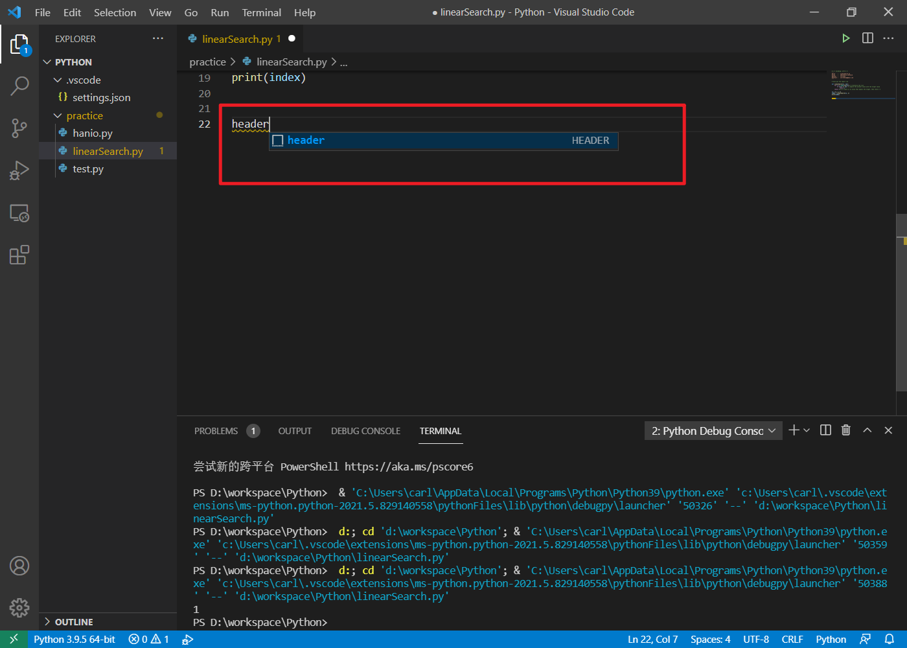

* 打开`File -> Preferences -> User Snippets`



* 添加python.json



* 文件内容

```json
{
    "HEADER":{
        "prefix": "header",
        "body": [
        "# -*- encoding: utf-8 -*-",
        "'''",
        "@File    :   $TM_FILENAME",
        "@Time    :   $CURRENT_YEAR/$CURRENT_MONTH/$CURRENT_DATE $CURRENT_HOUR:$CURRENT_MINUTE:$CURRENT_SECOND",
        "@Author  :   carlchen ",
        "@Contact :   carlchenxq@gmail.com",
        // "@License :   (C)Copyright 2017-2018, Liugroup-NLPR-CASIA",
        // "@Desc    :   None",
        
        "'''",
        "",
        "# here put the import lib",
        "$0"
    ],
    }
    
}
```

* 使用时在代码开始键入`header`就行了

