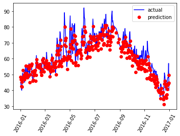

# 数据准备：导入、预处理
使用TensorFlow对于所给数据进行一个模型训练，训练的数据中包含了以下数据字段：
* year 年份
* month 月份
* day 日期
* week 周几
* temp_2 前两天的温度
* temp_1 前一天的温度
* average 当天的历史平均温度
* actural 当天的实际温度

接下来导入项目所需要的运行库


```python
import numpy as np
import pandas as pd
import matplotlib.pyplot as plt
import tensorflow as tf
from tensorflow.keras import layers
import tensorflow.keras
import warnings

warnings.filterwarnings("ignore")
%matplotlib inline
```


```python
# 查看数据
features = pd.read_csv("temps.csv")

print("数据规模: ", features.shape)

features.head()
```
    数据规模:  (348, 9)

<table border="1" class="dataframe">
  <thead>
    <tr style="text-align: right;">
      <th></th>
      <th>year</th>
      <th>month</th>
      <th>day</th>
      <th>week</th>
      <th>temp_2</th>
      <th>temp_1</th>
      <th>average</th>
      <th>actual</th>
      <th>friend</th>
    </tr>
  </thead>
  <tbody>
    <tr>
      <th>0</th>
      <td>2016</td>
      <td>1</td>
      <td>1</td>
      <td>Fri</td>
      <td>45</td>
      <td>45</td>
      <td>45.6</td>
      <td>45</td>
      <td>29</td>
    </tr>
    <tr>
      <th>1</th>
      <td>2016</td>
      <td>1</td>
      <td>2</td>
      <td>Sat</td>
      <td>44</td>
      <td>45</td>
      <td>45.7</td>
      <td>44</td>
      <td>61</td>
    </tr>
    <tr>
      <th>2</th>
      <td>2016</td>
      <td>1</td>
      <td>3</td>
      <td>Sun</td>
      <td>45</td>
      <td>44</td>
      <td>45.8</td>
      <td>41</td>
      <td>56</td>
    </tr>
    <tr>
      <th>3</th>
      <td>2016</td>
      <td>1</td>
      <td>4</td>
      <td>Mon</td>
      <td>44</td>
      <td>41</td>
      <td>45.9</td>
      <td>40</td>
      <td>53</td>
    </tr>
    <tr>
      <th>4</th>
      <td>2016</td>
      <td>1</td>
      <td>5</td>
      <td>Tues</td>
      <td>41</td>
      <td>40</td>
      <td>46.0</td>
      <td>44</td>
      <td>41</td>
    </tr>
  </tbody>
</table>


```python
# 处理一下时间数据，便于后期绘图
# 此部分与训练本身无关
import datetime

# 分别读取文件中的年月日信息
years = features['year']
months = features['month']
days = features['day']

# 将日期格式化保存
dates = [str(int(year)) + '-' + str(int(month)) + '-' + str(int(day)) for year, month, day in zip(years, months, days)]
dates = [datetime.datetime.strptime(date, '%Y-%m-%d') for date in dates]
dates[:5]
```


    [datetime.datetime(2016, 1, 1, 0, 0),
     datetime.datetime(2016, 1, 2, 0, 0),
     datetime.datetime(2016, 1, 3, 0, 0),
     datetime.datetime(2016, 1, 4, 0, 0),
     datetime.datetime(2016, 1, 5, 0, 0)]


```python
# 将weekday的字符串数据映射成数值数据（矩阵）
features = pd.get_dummies(features)
features.head(5)
```

<table border="1" class="dataframe">
  <thead>
    <tr style="text-align: right;">
      <th></th>
      <th>year</th>
      <th>month</th>
      <th>day</th>
      <th>temp_2</th>
      <th>temp_1</th>
      <th>average</th>
      <th>actual</th>
      <th>friend</th>
      <th>week_Fri</th>
      <th>week_Mon</th>
      <th>week_Sat</th>
      <th>week_Sun</th>
      <th>week_Thurs</th>
      <th>week_Tues</th>
      <th>week_Wed</th>
    </tr>
  </thead>
  <tbody>
    <tr>
      <th>0</th>
      <td>2016</td>
      <td>1</td>
      <td>1</td>
      <td>45</td>
      <td>45</td>
      <td>45.6</td>
      <td>45</td>
      <td>29</td>
      <td>1</td>
      <td>0</td>
      <td>0</td>
      <td>0</td>
      <td>0</td>
      <td>0</td>
      <td>0</td>
    </tr>
    <tr>
      <th>1</th>
      <td>2016</td>
      <td>1</td>
      <td>2</td>
      <td>44</td>
      <td>45</td>
      <td>45.7</td>
      <td>44</td>
      <td>61</td>
      <td>0</td>
      <td>0</td>
      <td>1</td>
      <td>0</td>
      <td>0</td>
      <td>0</td>
      <td>0</td>
    </tr>
    <tr>
      <th>2</th>
      <td>2016</td>
      <td>1</td>
      <td>3</td>
      <td>45</td>
      <td>44</td>
      <td>45.8</td>
      <td>41</td>
      <td>56</td>
      <td>0</td>
      <td>0</td>
      <td>0</td>
      <td>1</td>
      <td>0</td>
      <td>0</td>
      <td>0</td>
    </tr>
    <tr>
      <th>3</th>
      <td>2016</td>
      <td>1</td>
      <td>4</td>
      <td>44</td>
      <td>41</td>
      <td>45.9</td>
      <td>40</td>
      <td>53</td>
      <td>0</td>
      <td>1</td>
      <td>0</td>
      <td>0</td>
      <td>0</td>
      <td>0</td>
      <td>0</td>
    </tr>
    <tr>
      <th>4</th>
      <td>2016</td>
      <td>1</td>
      <td>5</td>
      <td>41</td>
      <td>40</td>
      <td>46.0</td>
      <td>44</td>
      <td>41</td>
      <td>0</td>
      <td>0</td>
      <td>0</td>
      <td>0</td>
      <td>0</td>
      <td>1</td>
      <td>0</td>
    </tr>
  </tbody>
</table>


原始数据准备好之后，可是基本的数据划分，对于以上原有数据划分出**数据**与**标签**两部分，并对于整个规模的数据划分出训练集与验证集。


```python
# 设置每一项数据的标签
# 当日的实际温度即标签值，其他项为其特征
labels = np.array(features['actual'])

# 在特征中去掉标签项
features = features.drop('actual', axis = 1)

# 备份
feature_list = list(features.columns)

# 将整个数据集转换成适合训练的数据格式
features = np.array(features)
```


```python
features.shape
```


    (348, 14)


```python
# 将数据中的大数值数据与小数值数据进行标准化
from sklearn import preprocessing
input_features = preprocessing.StandardScaler().fit_transform(features)
input_features[0]
```


    array([ 0.        , -1.5678393 , -1.65682171, -1.48452388, -1.49443549,
           -1.3470703 , -1.98891668,  2.44131112, -0.40482045, -0.40961596,
           -0.40482045, -0.40482045, -0.41913682, -0.40482045])


# 构建模型

```python
# 构建网络模型input(14) -> 16 -> 32 -> 1(output)
model = tf.keras.Sequential()
model.add(layers.Dense(16))
model.add(layers.Dense(32))
model.add(layers.Dense(1))
```


```python
# 制定优化器和损失函数
model.compile(optimizer=tf.keras.optimizers.SGD(0.001), 
                loss='mean_squared_error')
```

# 训练

```python
# 训练
# validation_split=0.25 表示将输入的数据中的四分之一用于验证
model.fit(input_features, labels, validation_split=0.25, epochs=50, batch_size=64)

```

    Epoch 1/50
    5/5 [==============================] - 0s 28ms/step - loss: 4233.1670 - val_loss: 3212.8074
    Epoch 2/50
    5/5 [==============================] - 0s 5ms/step - loss: 1773.9850 - val_loss: 3061.4246
    Epoch 3/50
    5/5 [==============================] - 0s 7ms/step - loss: 116.5189 - val_loss: 2507.3423
    Epoch 4/50
    5/5 [==============================] - 0s 6ms/step - loss: 65.6061 - val_loss: 2019.6670
    Epoch 5/50
    5/5 [==============================] - 0s 6ms/step - loss: 167.3724 - val_loss: 1606.0837
    Epoch 6/50
    5/5 [==============================] - 0s 6ms/step - loss: 55.5278 - val_loss: 1013.5287
    Epoch 7/50
    5/5 [==============================] - 0s 7ms/step - loss: 68.3863 - val_loss: 1055.1143
    Epoch 8/50
    5/5 [==============================] - 0s 8ms/step - loss: 41.0352 - val_loss: 1037.4230
    Epoch 9/50
    5/5 [==============================] - 0s 8ms/step - loss: 69.3357 - val_loss: 965.5453
    Epoch 10/50
    5/5 [==============================] - 0s 8ms/step - loss: 104.1573 - val_loss: 908.2845
    Epoch 11/50
    5/5 [==============================] - 0s 9ms/step - loss: 259.3140 - val_loss: 490.2180
    Epoch 12/50
    5/5 [==============================] - 0s 9ms/step - loss: 94.2591 - val_loss: 517.3662
    Epoch 13/50
    5/5 [==============================] - 0s 8ms/step - loss: 65.6759 - val_loss: 365.5643
    Epoch 14/50
    5/5 [==============================] - 0s 10ms/step - loss: 51.3823 - val_loss: 413.3629
    Epoch 15/50
    5/5 [==============================] - 0s 8ms/step - loss: 339.1319 - val_loss: 375.7856
    Epoch 16/50
    5/5 [==============================] - 0s 7ms/step - loss: 33.9387 - val_loss: 276.1273
    Epoch 17/50
    5/5 [==============================] - 0s 9ms/step - loss: 29.0739 - val_loss: 271.5089
    Epoch 18/50
    5/5 [==============================] - 0s 8ms/step - loss: 32.6289 - val_loss: 212.3020
    Epoch 19/50
    5/5 [==============================] - 0s 8ms/step - loss: 34.1507 - val_loss: 117.8080
    Epoch 20/50
    5/5 [==============================] - 0s 6ms/step - loss: 36.8833 - val_loss: 158.5959
    Epoch 21/50
    5/5 [==============================] - 0s 6ms/step - loss: 28.1682 - val_loss: 191.8987
    Epoch 22/50
    5/5 [==============================] - 0s 7ms/step - loss: 83.2684 - val_loss: 113.7243
    Epoch 23/50
    5/5 [==============================] - 0s 8ms/step - loss: 67.4941 - val_loss: 114.0941
    Epoch 24/50
    5/5 [==============================] - 0s 7ms/step - loss: 29.9459 - val_loss: 108.8346
    Epoch 25/50
    5/5 [==============================] - 0s 7ms/step - loss: 51.8957 - val_loss: 128.1973
    Epoch 26/50
    5/5 [==============================] - 0s 8ms/step - loss: 72.5537 - val_loss: 118.4581
    Epoch 27/50
    5/5 [==============================] - 0s 8ms/step - loss: 33.8232 - val_loss: 63.2183
    Epoch 28/50
    5/5 [==============================] - 0s 8ms/step - loss: 88.8874 - val_loss: 39.6367
    Epoch 29/50
    5/5 [==============================] - 0s 7ms/step - loss: 28.8687 - val_loss: 55.5033
    Epoch 30/50
    5/5 [==============================] - 0s 7ms/step - loss: 24.9830 - val_loss: 51.8633
    Epoch 31/50
    5/5 [==============================] - 0s 7ms/step - loss: 42.2130 - val_loss: 52.7679
    Epoch 32/50
    5/5 [==============================] - 0s 7ms/step - loss: 33.1545 - val_loss: 52.1013
    Epoch 33/50
    5/5 [==============================] - 0s 6ms/step - loss: 71.9282 - val_loss: 87.5150
    Epoch 34/50
    5/5 [==============================] - 0s 10ms/step - loss: 35.1182 - val_loss: 27.0802
    Epoch 35/50
    5/5 [==============================] - 0s 7ms/step - loss: 26.7279 - val_loss: 39.7530
    Epoch 36/50
    5/5 [==============================] - 0s 10ms/step - loss: 25.2314 - val_loss: 44.0000
    Epoch 37/50
    5/5 [==============================] - 0s 7ms/step - loss: 29.8892 - val_loss: 34.0598
    Epoch 38/50
    5/5 [==============================] - 0s 6ms/step - loss: 40.7406 - val_loss: 24.6141
    Epoch 39/50
    5/5 [==============================] - 0s 7ms/step - loss: 50.4433 - val_loss: 68.8121
    Epoch 40/50
    5/5 [==============================] - 0s 5ms/step - loss: 72.7355 - val_loss: 40.3148
    Epoch 41/50
    5/5 [==============================] - 0s 6ms/step - loss: 26.5979 - val_loss: 26.8386
    Epoch 42/50
    5/5 [==============================] - 0s 7ms/step - loss: 29.6661 - val_loss: 21.0548
    Epoch 43/50
    5/5 [==============================] - 0s 6ms/step - loss: 28.1630 - val_loss: 42.7691
    Epoch 44/50
    5/5 [==============================] - 0s 8ms/step - loss: 28.2395 - val_loss: 87.7709
    Epoch 45/50
    5/5 [==============================] - 0s 7ms/step - loss: 42.0702 - val_loss: 51.0557
    Epoch 46/50
    5/5 [==============================] - 0s 8ms/step - loss: 43.4924 - val_loss: 51.4916
    Epoch 47/50
    5/5 [==============================] - 0s 7ms/step - loss: 31.0340 - val_loss: 50.2235
    Epoch 48/50
    5/5 [==============================] - 0s 8ms/step - loss: 34.8364 - val_loss: 36.0122
    Epoch 49/50
    5/5 [==============================] - 0s 8ms/step - loss: 24.7607 - val_loss: 30.7038
    Epoch 50/50
    5/5 [==============================] - 0s 6ms/step - loss: 37.9924 - val_loss: 38.3052

可以看到，在上面的训练模型当中，训练集和测试集的损失值基本一致。接下来进行预测。
## 预测

```python
predict = model.predict(input_features)

# 创建一个表格来存日期和其对应的标签值
true_data = pd.DataFrame(data = {'date': dates, 'actual': labels})

# 再创建一个表格存储日期对应的模型预测值
years = features[:, feature_list.index('year')]
months = features[:, feature_list.index('month')]
days = features[:, feature_list.index('day')]

test_dates = [str(int(year)) + '-' + str(int(month)) + '-' + str(int(day)) for year, month, day in zip(years, months, days)]
test_dates = [datetime.datetime.strptime(date, '%Y-%m-%d') for date in test_dates]

prediction_datas = pd.DataFrame(data = {'date': test_dates, 'prediction': predict.reshape(-1)})


```


```python
# 绘图
# 真实值（标签值）
plt.plot(true_data['date'], true_data['actual'], 'b-', label = 'actual')

# 预测值
plt.plot(prediction_datas['date'], prediction_datas['prediction'], 'ro', label = 'prediction')
plt.xticks(rotation = '60')
plt.legend()
```



​    

