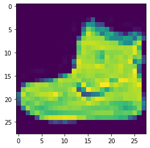
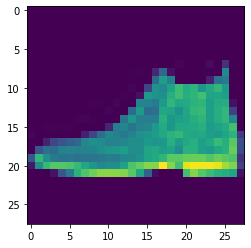
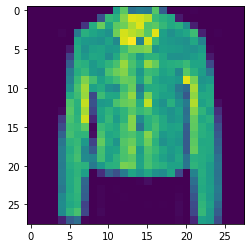
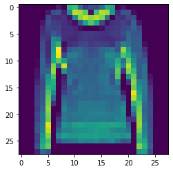
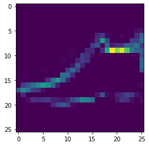
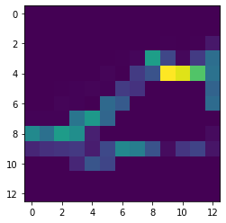

* 图像数据集包含了日常生活中常用的10类服饰
    * 0. T-shirt
    * 1. Trousers
    * 2. Pullover shirt
    * 3. Dress
    * 4. Coat
    * 5. Sandal
    * 6. Shirt
    * 7. Sneakers
    * 8. Bog
    * 9. Ankle boot
* 每个图像是由28*28个像素点组成,每个像素点有1个通道的灰度图
* 基于前面做过的全连接神经网络，在其中增加卷积层和池化层


```python
import tensorflow as tf
from tensorflow import keras
import numpy as np

# to solve the "NotFoundError: No algorithm worked!" bug, for low Gmemory GPUs
# check https://github.com/tensorflow/tensorflow/issues/43174
# to avoid the crash by the limit of graphic memory
from tensorflow.compat.v1 import ConfigProto
from tensorflow.compat.v1 import InteractiveSession

config = ConfigProto()
config.gpu_options.allow_growth = True
session = InteractiveSession(config=config)
```


```python
# import the dataset
fashion_minst = keras.datasets.fashion_mnist

# divid into training set and test set
(train_images, train_labels), (test_images, test_labels) = fashion_minst.load_data()

import matplotlib.pyplot as plt
plt.imshow(train_images[0])
train_labels[0]
```


```bash
output: 9
```



    

```python
# construct the model
model = keras.Sequential()

# cnn layers and pooling layers
model.add(keras.layers.Conv2D(64, (3,3), activation='relu', input_shape=(28,28,1)))
model.add(keras.layers.MaxPool2D(2,2))
model.add(keras.layers.Conv2D(64, (3,3), activation='relu'))
model.add(keras.layers.MaxPool2D(2,2))

# full connection layers
model.add(keras.layers.Flatten())
model.add(keras.layers.Dense(128,activation=tf.nn.relu))
model.add(keras.layers.Dense(10,activation=tf.nn.softmax))

# simplify dataset, divid by 255 per pixel
train_images_scaled = train_images/255

# compile the model and do the training
model.compile(optimizer=tf.optimizers.Adam(), loss=tf.losses.sparse_categorical_crossentropy, metrics=['accuracy'])
model.fit(train_images_scaled.reshape(-1,28,28,1), train_labels, epochs=5)
```

    Epoch 1/5
    1875/1875 [==============================] - 11s 4ms/step - loss: 0.6107 - accuracy: 0.7796
    Epoch 2/5
    1875/1875 [==============================] - 8s 4ms/step - loss: 0.3032 - accuracy: 0.8882
    Epoch 3/5
    1875/1875 [==============================] - 7s 4ms/step - loss: 0.2522 - accuracy: 0.9068
    Epoch 4/5
    1875/1875 [==============================] - 8s 4ms/step - loss: 0.2154 - accuracy: 0.9197
    Epoch 5/5
    1875/1875 [==============================] - 8s 4ms/step - loss: 0.1900 - accuracy: 0.9294


```python
# test
test_images_scaled = test_images/255
model.evaluate(test_images_scaled.reshape(-1,28,28,1), test_labels)
```

    313/313 [==============================] - 1s 3ms/step - loss: 0.2384 - accuracy: 0.9137
    [0.2383878231048584, 0.9136999845504761]


```python
print(model.predict(tf.reshape(test_images[0]/255,(-1,28,28,1))))

print('Predict: ', np.argmax(model.predict(tf.reshape(test_images[0]/255,(-1,28,28,1))))
        ,'\nActual: ', test_labels[0])

plt.imshow(test_images_scaled[0])

```

    [[2.5290245e-07 6.1788612e-08 5.5701182e-08 1.7663554e-07 2.7881084e-08
      5.4850774e-05 5.8558425e-09 6.0579394e-05 5.5103959e-07 9.9988341e-01]]
    Predict:  9 
    Actual:  9



    


```python
print(model.predict(tf.reshape(test_images[10]/255,(-1,28,28,1))))

print('Predict: ', np.argmax(model.predict(tf.reshape(test_images[10]/255,(-1,28,28,1))))
        ,'\nActual: ', test_labels[10])

plt.imshow(test_images_scaled[10])
```

    [[2.3616798e-05 3.7652927e-07 2.9694552e-03 2.7757017e-07 9.7015500e-01
      4.1320046e-08 2.6849413e-02 1.6719781e-09 1.8250663e-08 1.8690541e-06]]
    Predict:  4 
    Actual:  4



    


```python
print(model.predict(tf.reshape(test_images[110]/255,(-1,28,28,1))))

print('Predict: ', np.argmax(model.predict(tf.reshape(test_images[110]/255,(-1,28,28,1))))
        ,'\nActual: ', test_labels[110])

plt.imshow(test_images_scaled[110])
```

    [[8.0917077e-03 2.4528191e-09 9.8577511e-01 1.5102766e-05 1.0863699e-04
      1.6482956e-11 6.0092965e-03 3.4937552e-12 5.4715077e-10 3.5497050e-10]]
    Predict:  2 
    Actual:  2



    


在查看该模型预测的结果之后，我们还可以对其卷积层产生的结果进行查看，了解在神经网络内部，图像所呈现的特征的模样。


```python
model.summary()
```

    Model: "sequential"
    _________________________________________________________________
    Layer (type)                 Output Shape              Param #   
    =================================================================
    conv2d (Conv2D)              (None, 26, 26, 64)        640       
    _________________________________________________________________
    max_pooling2d (MaxPooling2D) (None, 13, 13, 64)        0         
    _________________________________________________________________
    conv2d_1 (Conv2D)            (None, 11, 11, 64)        36928     
    _________________________________________________________________
    max_pooling2d_1 (MaxPooling2 (None, 5, 5, 64)          0         
    _________________________________________________________________
    flatten (Flatten)            (None, 1600)              0         
    _________________________________________________________________
    dense (Dense)                (None, 128)               204928    
    _________________________________________________________________
    dense_1 (Dense)              (None, 10)                1290      
    =================================================================
    Total params: 243,786
    Trainable params: 243,786
    Non-trainable params: 0
    _________________________________________________________________


```python
# read every layer of the model
layer_outputs = [layer.output for layer in model.layers]
# create a object to put togather the input and output, used for predicting the single image
activiation_model = tf.keras.Model(inputs = model.input, outputs = layer_outputs)
# predict
pred = activiation_model.predict(test_images[0].reshape(1,28,28,1))
```

可以看到有七个层对应的输出


```python
len(pred)
# down below is the length of the 'pred' list, there are 7 arrays for each output of each layer
```

对于测试集的第一张图像查看其卷积之后的效果，神经网络中看到的图像模样（矩阵模样）


```python
print(pred[0].shape)
plt.imshow(pred[0][0,:,:,1])
```

    (1, 26, 26, 64)



    

```python
print(pred[1].shape)
plt.imshow(pred[1][0,:,:,1])
```

    (1, 13, 13, 64)



    