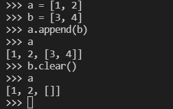
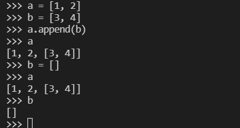

硬着头皮用不太会的 Python 写项目的时候，出现了一个 bug。调试的发现 list 使用 append() 和 clear() 的时候会出现一种情况：

我在 list B 中 append() 了 list A，然后我将 list A 使用 clear() 清空之后，B 中的元素也会被清空。

像这样：

为了解决这个问题，可以把 clear() 换成直接赋空值的方式，这样的话，原 list 地址的值就不会被清空

